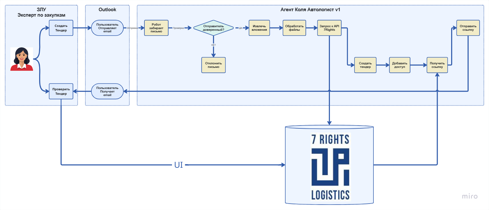

# Скрипт автоматизации бизнес-кейса "Создание драфта RFQ на основе вложений почтового ящика"

## Базовая логика скрипта

1. Робот забирает почту с выделенного почтового ящика от доверенного отправителя(ей), сохранет локально Excel вложения из письма
2. Парсит вложения и, используя эту информацию, выполняет запрос к 7Rights REST API для создания драфта нового RFQ
3. Отвечает отправителю на письмо, отправляя в ответе ссылку на созданный драфт RFQ (для ручной верификации)

## Верхнеуровневая бизнес-диаграмма автоматизмруемого процесса



## Детализация логики
### 1. Забор почты 
- при запуске робот проверяет выделенный почтовый ящик (задается через `MAILBOX_NAME` `MAILBOX_APP_PASSWORD` в `.env`)
- скачивает письма с вложениями (письма без вложений сразу игнорируются на уровне поиска IMAP)
- проверяет отправителя по списку доверенных адресатов. Если адресат не из списка, письмо помещается в специальную локальную папку `junk` и далее не обрабатывается
- сохраняет из письма всю метаинформацию (для последующего ответа), вложения в формате Excel, раскладывает по папкам. Иные вложения (при наличии) игнорируются
- ранее сохраненные письма не перезаписываются (используется UID message-id)
- выводит в лог статистику о том, сколько писем было получено, сколько получено ранее, сколько сохранено

### 2. Валидация файловых вложений из писем
- для скаченных писем (в локальных папках) проверяется количество Excel-вложений (должно быть 2)
- проверяется наличие обязательных полей 
- при отсуствии нужного количества вложений или несоответствии формата ставится флаг `do_not_process` в папке соответсвующего письма

### 3. Создание драфта RFQ
- для сохраненных писем если нет флага `reply_sent` (ответ направлен ранее) или `do_not_process` (недостаточно информации для создания RFQ) подготавливается json структура `rfq_excel`, соответствующая RfqCreateRequest OpenAPI специцикации. Маппинг наименований полей и значений из Excel на наименования и значения json payload осуществляется внутри скрипта
- проверятеся сущестсование RFQ с тем же наименованием (```GET /api/v1/rfq?search=title```). Если наименованиие совпало, дальнейшие запросы на API не выполняются, даный факт логируется для дальнейшей отправки по почте
- отправляется запрос создания RFQ ```POST /api/v1/rfq```
- отправляется запрос добавления поставщиков ```PUT /api/v1//rfq/{rfq_id}```
- полные права пользователям назначаются через передачу соотв IDs в начальню подструктуру запроса. Выполнения отдельных запросов для назначения прав не требуется
- возвращенный RFQ ID подставляются в шаблон гиперссылки для последующей отправки по почте для прямого просмотра драфта RFQ через ЛК пользователя
- если произошла ошибка взаимодействия с API, текст ошибка подставляется в шаблон для последующей отправки по почте
- ссылка на RFQ и/или описание возникшей ошибки сохраняется в локальной папке с письмом в отдельном json файле `rfq_info`

### 4. Подготовка шаблона ответного письма
- для сохраненных локально писем если нет флага `reply` (ответ был составлен ранее) и есть флаг `rfq_info` (есть ответ от API - с ошибкой или ссылкой) создается шаблон ответного письма `reply`, который может содержать либо веб-ссылку на драфт RFQ, либо описание ошибок валидации/ответов API, либо и то и другое

### 5. Отправка ответа
- для сохраненных локально писем если нет флага `reply_sent` (ответ был направлен ранее) и есть флаг `reply` (есть шаблон ответа) берется шаблон ответного письма и на основе метаинформации соответствующего входящего письма отсылаются ответные письма отправителям


## Детализированная Flowchart-диаграмма логики скрипта

```mermaid
flowchart TD

    A([Старт]) --> B[Проверка почтового ящика]

    %% Получение почты
    B --> C{"Письмо содержит вложения?"}

    C -- Нет --> C1[Игнорировать письмо]
    C -- Да --> D{"Отправитель доверенный?"}

    D -- Нет --> D1[Переместить письмо в папку junk]
    D -- Да --> E{"Письмо уже сохранено?"}

    E -- Да --> E1[Увеличить счетчик получено ранее]
    E -- Нет --> F[Сохранить метаданные письма]
    F --> G[Сохранить Excel-вложения]
    G --> H[Игнорировать остальные вложения]
    H --> I[Увеличить счетчик сохраненных]

    C1 --> J
    D1 --> J
    E1 --> J
    I --> J

    J[Записать статистику в лог]

    %% Валидация
    J --> K[Проверить сохраненные письма]

    K --> L{"Количество Excel = 2?"}

    L -- Нет --> L1[Установить do_not_process]
    L -- Да --> M{"Все обязательные поля заполнены?"}

    M -- Нет --> L1
    M -- Да --> N[Сформировать json rfq_excel]

    %% Создание RFQ
    N --> O{"Есть reply_sent или do_not_process?"}

    O -- Да --> P[Пропустить создание RFQ]

    O -- Нет --> API1["Поиск: GET /api/v1/rfq?search=title"]

    API1 --> R{"RFQ уже существует?"}

    R -- Да --> S1[Зафиксировать найденный RFQ]

    R -- Нет --> API2["Создание RFQ: POST /api/v1/rfq"]

    API2 --> API3["Добавление поставщиков: PUT /api/v1/rfq/{rfq_id}"]

    API3 --> API4["Загрузка шаблона лота: POST /api/v1/rfq/lot-templates/import"]

    API4 --> API5["Привязка шаблона лота к RFQ: POST /api/v1//rfq/{rfq_id}/lot"]

    API5 --> U{"Запросы выполнены успешно?"}

    U -- Да --> V[Сформировать ссылку на RFQ]

    U -- Нет --> W[Сохранить текст ошибки API]

    S1 --> X
    V --> X
    W --> X

    X[Сохранить rfq_info]

    %% Подготовка ответа
    X --> Y

    P --> Y

    Y{"reply уже существует?"}

    Y -- Да --> Z[Пропустить]

    Y -- Нет --> AA{"Есть rfq_info?"}

    AA -- Нет --> Z
    AA -- Да --> AB[Создать reply]

    %% Отправка ответа
    Z --> AC
    AB --> AC

    AC{"Есть reply_sent?"}

    AC -- Да --> AD[Пропустить отправку]

    AC -- Нет --> AE{"Есть reply?"}

    AE -- Нет --> AD

    AE -- Да --> AF[Отправить ответное письмо]

    AF --> AG[Установить reply_sent]

    AD --> AH([Завершение])
    AG --> AH

    %% Выделение API-вызовов
    classDef api fill:#D6EAF8,stroke:#1F78B4,stroke-width:2px,color:#000,font-weight:bold;

    class API1,API2,API3,API4,API5 api;
```




## Настройка локальной среды **разработки** проекта

### 1. Клонирование репозитория

```bash
git clone <repository-url>
cd api-integration
```

### 2. Создание виртуального окружения

**Windows:**
```bash
python -m venv venv
.\venv\Scripts\activate
```

**Linux/Mac:**
```bash
python -m venv venv
source venv/bin/activate
```

### 3. Установка зависимостей

```bash
pip install --upgrade pip
pip install -e .
```

### 4. Настройка конфигурации

Скопируйте файл с примером конфигурации и заполните его:

```bash
cp .env.example .env
```

Отредактируйте `.env` файл, указав:
- `MAILBOX_NAME` - имя почтового ящика
- `MAILBOX_APP_PASSWORD` - пароль приложения для почты
- `IMAP_SERVER` / `IMAP_PORT` - параметры IMAP
- `SMTP_SERVER` / `SMTP_PORT` - параметры SMTP
- `SEVEN_RIGHTS_API_BASE_URL` / `SEVEN_RIGHTS_API_VERSION` / `SEVEN_RIGHTS_API_KEY` - параметры API 7Rights
- `APP_ENV=dev`

Создайте файл с доверенными адресатами:

```bash
# Создайте config/trusted_recipients.json
# с списком доверенных email адресов
```

### 5. Проверка установки

```bash
python -c "import api_integration; print('OK')"
```

### 6. Запуск скрипта в режиме отладки и тестирования (`dev mode`)

Изменяем параметры запуска прямо в `main.py`

- `subfolder` - ID конкретного письма для обработки (`None` - все письма, исключая `junk`)
- `dry_run=True` - тестовый режим без записи/отправки
- `test_run=True` - принудительная обработка (игнорирует флаги, комбинируем с subfolder)

запускаем

```bash
python ./scripts/main.py
```


## Сборка и распространение приложения (build/install)

- [BUILD_WHEEL.md](docs/BUILD_WHEEL.md) — как собрать wheel проекта
- [INSTALL_FROM_WHEEL.md](docs/INSTALL_FROM_WHEEL.md) — как установить wheel на целевую машину
- [VERIFICATION.md](docs/VERIFICATION.md) - как установить wheel и проверить скрипт на целевой машине (`prod mode`)


## Где смотреть настройки скрипта

Для пользователя
* `.env` - локальный файл с секретами для переменных окружения (**необходимо создать** в корне и заполнить ключи значениями по шаблону `.env.example`)
* `/config/trusted_recipients.json` - доверенные адресаты 

Для программиста также 
* `/src/constants.py` - константы, пути, маппинги, шаблоны, etc. (назначение объяснено в комментарии к каждой переменной)


