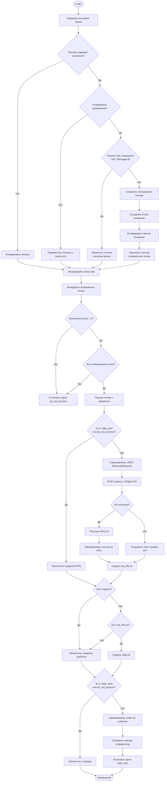

# Скрипт автоматизации бизнес-кейса "Создание драфта FRQ на основе вложений почтового ящика"

## Базовая логика скрипта

1. Робот забирает почту с выделенного почтового ящика от доверенного отправителя(ей), сохранет локально Excel вложения из письма
2. Парсит вложения и, используя эту информацию, выполняет запрос к 7Rights REST API для создания драфта нового RFQ
3. Отвечает отправителю на письмо, отправляя в ответе ссылку на созданный драфт RFQ (для ручной верификации)

## Верхнеуровневая бизнес-диаграмма автоматизмруемого процесса


## Детализация логики
1. Забор почты 
- при запуске робот проверяет выделенный почтовый ящик <nikolavtologistov@yandex.ru>
- скачивает письма с вложениями (письма без вложений сразу игнорируются на уровне поиска IMAP)
- проверяет отправителя по списку доверенных адресатов. Если адресат не из списка, письмо помещается в спец локальную папку junk
- сохраняет из письма всю метаинформацию (для последующего ответа), вложения в формате Excel, раскладывает по папкам. Иные вложения (при наличии) игнорируются
- ранее сохраненные письма не перезаписываются (используется UID message-id)
- выводит (в лог) статистику о том, сколько писем было получено, сколько получено ранее, сколько сохранено

2. Валидация файловых вложений из писем
- для скаченных писем (в локальных папках) проверяется количество Excel-вложений (должно быть 2)
- проверяется наличие обязательных полей 
- при отсуствии нужного количества вложений или несоответствии формата ставится флаг `do_not_process` в папке соответсвующего письма

3. Создание драфта FRQ
- для сохраненных писем если нет флага `reply_sent` (ответ направлен ранее) или `do_not_process` (недостаточно информации для создания FRQ) подготавливается json-структура, соответствующая `RfqCreateRequest`. Предполагается что Excel файл вложения удже содержит необходимые числовые идентификаторы для справочных полей, доп маппинг не требуется
- отправляется запрос POST запрос на API endpoint 7Rights
- права пользователю назначаются через передачу соотв IDs в поле `user_access_ids` (Пользователи с доступом к редактированию RFQ) запроса
- возвращенный ID RFQ подставляются в шаблон гиперссылки для последующей отправки по почте для прямого просмотра драфта RFQ через ЛК пользователя
- если произошла ошибка взаимодействия с API, текст ошибка подставляется в шаблон для последующей отправки по почте
- ссылка на RFQ или описание возникшей ошибки сохраняется в локальной папке с письмом в отдельном json файле `rfq_info`

4. Подготовка шаблона ответного письма
- для сохраненных локально писем если нет флага `reply` (ответ был составлен ранее) и есть флаг `rfq_info` (есть ответ от API - с ошибкой или ссылкой) создается шаблон ответного письма `reply`, который включает либо ссылку на драфт RFQ либо опиисание ошибки API

5. Отправка ответа
- для сохраненных локально писем если нет флага `reply_sent` (ответ был направлен ранее) или `do_not_process` (TBD)(недостаточно информации для создания FRQ) берется шаблон ответного письма `reply` и на основе метаинформации соответствующего входящего писма отсылаются ответные письма отправителям


## Детализированная Flowchart-диаграмма логики скрипта


## Как запустить скрипт

```
python src/main.py
```